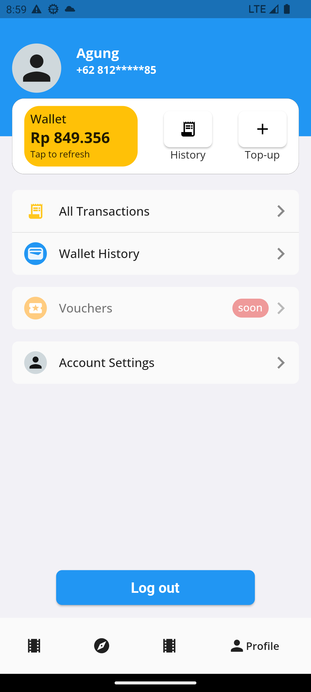

# Flutter Movie APP

FL-Mov stands as the ultimate movie app, seamlessly combine the convenience of easy ticket purchasing with a comprehensive cinematic exploration provided by [TMDB](https://www.themoviedb.org/). Whether you're securing seats for the latest releases or delving into in-depth information about your favorite films, actors, and directors, our user-friendly app guarantees to be your go-to solution for all things cinema, offering a seamless and immersive experience designed for movie enthusiasts and casual viewers alike

## In-app screenshots

### In Cinema

 &nbsp;  &nbsp;  &nbsp;   

### Discover
 &nbsp;  &nbsp;  

### And more
 &nbsp;  &nbsp;  &nbsp; 

## Project Overview
The app development is divided into two primary components. [Server-sided/backend application](https://github.com/agung-w/multiplatform_ticket_api), which utilizes the Ruby on Rails framework, and the [client application](https://github.com/agung-w/FL-Mov), which is built using the Flutter framework. As mentioned earlier, the movie exploration results are provided by [TMDB](https://www.themoviedb.org/) (The Movie Database), ensuring a comprehensive and reliable source for all your cinematic queries.

## Stack & Libs
- [Flutter](https://flutter.dev/) 
- [Ruby on Rails](https://rubyonrails.org/)
- [PostgreSQL](https://www.postgresql.org/)
- [Bloc](https://bloclibrary.dev/#/) for state management.
- [Dio](https://pub.dev/packages/dio) for communicating with the APIs.
- [Freezed](https://pub.dev/packages/freezed) for faster development (generator to remove boiler plate code).
- [QR Flutter](https://pub.dev/packages/qr_flutter) for ticket QR code generator.
- [Whatsapp SDK](https://www.rubydoc.info/gems/whatsapp_sdk/0.7.0) for sending OTP to verify phone number.
- [Kimurai](https://github.com/vifreefly/kimuraframework) for scraping anohter website to get an actual theater movie & schedule.

